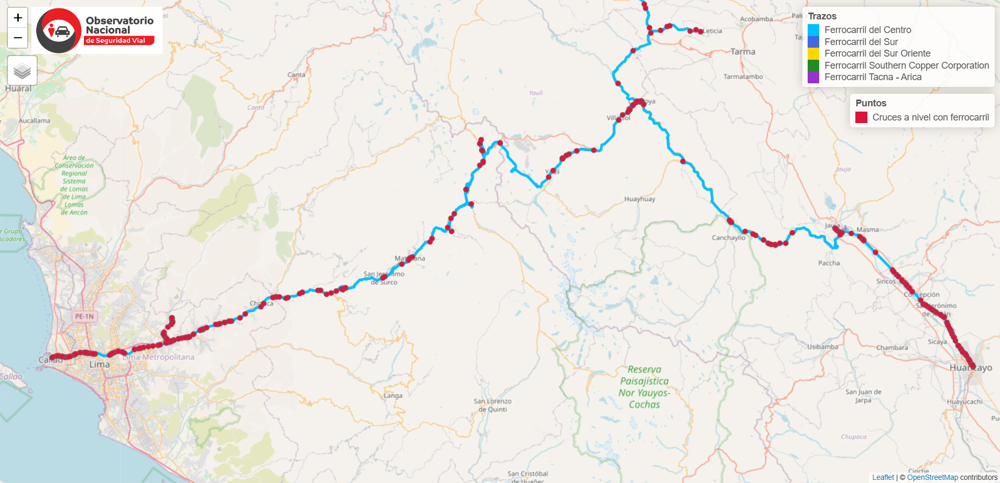

<a href="https://www.onsv.gob.pe/"> </a>


## ¿Cómo extraer datos georeferenciados de OpenStreetMap para su exploración en la movilidad sostenible y segura? 

### Guía de código en R

**Especialista responsable:** <br />
Patricia Illacanchi Guerra

## Introducción

En esta guía, aprenderemos a utilizar la biblioteca `osmdata` en R para la extracción de datos ferroviarios de OpenStreetMap (OSM) específicamente para Perú. Exploraremos cómo obtener datos de rutas ferroviarias y cruces a nivel, así como algunas técnicas básicas para el procesamiento y visualización de estos datos.

OpenStreetMap (OSM) es una plataforma colaborativa de datos geoespaciales de acceso libre, donde se puede encontrar información detallada sobre infraestructuras como carreteras, ferrocarriles, edificios, entre otros. OSM utiliza un formato basado en elementos clave (`key`) y valores (`value`) para describir estos datos. En nuestro caso, nos enfocaremos en la infraestructura ferroviaria.

## 1. ¿Qué es OpenStreetMap?
OpenStreetMap (OSM) es un proyecto colaborativo que proporciona un mapa global editable y libre. Los usuarios pueden visualizar, editar y utilizar información geoespacial del mundo entero. OSM se destaca por:
- **Accesibilidad**: Información disponible de manera libre y abierta.
- **Cobertura**: Incluye carreteras, ferrocarriles, edificios, parques, cuerpos de agua, etc.
- **Participación Colaborativa**: Los datos son generados y actualizados por una comunidad global de usuarios.

### Datos que se pueden obtener en OSM
A través de OSM, es posible acceder a información como:
- Rutas de transporte (carreteras, ferrocarriles, rutas de bicicleta).
- Infraestructuras (edificios, estaciones de tren, hospitales).
- Puntos de interés (restaurantes, parques, áreas recreativas).
- Elementos naturales (ríos, montañas, áreas verdes).

### Sintaxis Básica en OSM
En OSM, se utiliza un sistema de "llave-valor" para definir elementos. Por ejemplo:
- `key = "highway", value = "primary"` obtiene carreteras principales.
- `key = "railway", value = "rail"` busca ferrocarriles en uso.
- `key = "amenity", value = "hospital"` encuentra hospitales.

## 2. Configuración y Extracción de Datos en R

### Instalación de Paquetes Necesarios
Para realizar consultas en OSM desde R, es necesario instalar y cargar algunos paquetes:

```r
# Instalar paquetes si no están instalados
install.packages("osmdata")
install.packages("sf")
install.packages("tmap")
install.packages("htmlwidgets")

# Cargar las bibliotecas necesarias
library(osmdata)
library(sf)
library(tmap)
library(htmlwidgets)
```

### 2.1 Definición de la Bounding Box o  Área de Interés para Perú
En lugar de utilizar coordenadas aproximadas, se usará una consulta específica para Perú:

```r
# Obtener la bounding box específica para Perú usando el nombre del país
bbox_peru <- getbb("Peru")
```
Alternativamente, es posible usar una caja de borde o bounding box que encierre todo el área de interés para la extracción de datos:
```r
# Definir una bounding box para Perú o algna ciudad 
bbox_peru <- c(-81.35, -18.35, -68.65, 0.12)  # (min_lon, min_lat, max_lon, max_lat)
```
### 2.2 Extracción de Rutas Ferroviarias
A continuación, se muestra el código para extraer las rutas ferroviarias activas en Perú:
```r
# Crear consulta usando el bounding box
query <- opq(bbox = bbox_peru) %>%
  add_osm_feature(key = "route", value = "railway")

# Recuperar los datos
rail_data_peru <- osmdata_sf(query)

# Extraer las rutas ferroviarias
rail_routes_peru <- rail_data_peru$osm_lines

# Visualizar las rutas ferroviarias
plot(st_geometry(rail_routes_peru), col = "blue")
```
### 2.3 Limpieza y Transformación de Datos
Filtramos las vías en desuso y corregimos los datos de calibre:
```r
# Filtrar vías en desuso
rail_routes_peru <- rail_routes_peru[rail_routes_peru$railway != "abandoned" & rail_routes_peru$railway != "disused", ]

# Actualizar tipo de gauge (calibre)
rail_routes_peru[rail_routes_peru$osm_id == 150987784, ]$gauge <- "1435"
rail_routes_peru[rail_routes_peru$osm_id == 790095411, ]$gauge <- "1435"
rail_routes_peru[rail_routes_peru$osm_id == 150987791, ]$gauge <- "1435"

# Transformar coordenadas
rail_routes_peru <- rail_routes_peru %>%
  st_transform(4326)

```
### 2.4 Asignación de Información de Operador y Nombres
Identificamos diferentes rutas ferroviarias y les asignamos el operador correspondiente, así como otra información que pueda ser verificada con Ositran y otras entidades y operadores involucrados
```r
# Asignar operador y nombre según región geográfica
# Ejemplo: Ferrocarril del Centro - Ferrovías Central Andina S.A.

# Definir un bounding box para identificar las líneas
bbox <- st_bbox(c(xmin = -77.307761, ymin = -12.344832, xmax = -75.159841, ymax = -10.461275), crs = 4326)
bbox_polygon <- st_as_sfc(bbox)

# Identificar líneas dentro del bounding box
within_bbox <- st_within(rail_routes_peru, bbox_polygon)
within_bbox <- sapply(within_bbox, function(x) ifelse(length(x) == 0, 0, 1))

# Asignar nombre y operador
rail_routes_peru$within_bbox <- within_bbox
rail_routes_peru[rail_routes_peru$within_bbox == 1, ]$name <- "Ferrocarril del Centro"
rail_routes_peru[rail_routes_peru$within_bbox == 1, ]$operator <- "Ferrovías Central Andina S.A."

```
### 2.5 Extracción de Intersecciones Ferroviarias (Railroad crossings)
Realizamos una consulta adicional para obtener datos sobre cruces ferroviarios:
```r
# Crear consulta para cruces a nivel ferroviarios
query <- opq(bbox = bbox_peru) %>%
  add_osm_feature(key = "railway", value = "level_crossing")

# Recuperar los datos
level_crossings_peru <- osmdata_sf(query)

# Extraer cruces a nivel como objeto sf
level_crossings_points <- level_crossings_peru$osm_points  # Geometrías de puntos

# Limpieza de cruces no deseados
not_desired <- c(4937721971, 7548874513, 7206992004, 10806641416)
level_crossings_points <- level_crossings_points[!level_crossings_points$osm_id %in% not_desired, ]
```
### 2.6 Visualización de Datos en un Mapa Interactivo
Utilizaremos la librería `tmap` para visualizar nuestras rutas ferroviarias y los cruces a nivel en un mapa interactivo:
```r
# Visualización en mapa interactivo
my_map <- tm_basemap(leaflet::providers$OpenStreetMap, alpha = 0.8) +
  tm_shape(rail_routes_peru) +
  tm_lines(col = "name", lwd = 4, palette = c("#00BFFF", "#4169E1", "#FFD700", "#228B22", "#9932CC"),
           title.col = "Trazos", popup.vars = c("name", "operator")) +
  tm_shape(level_crossings_points) +
  tm_dots(col = "name", size = 0.05, palette = "#DC143C", title = "Cruces a Nivel", popup.vars = c("name", "operator"))

# Convertir a formato Leaflet
my_map <- tmap_leaflet(my_map)

# Guardar el mapa en un archivo HTML
library(htmlwidgets)
saveWidget(my_map, "rail_road_map_onsv.html", selfcontained = TRUE)
```
En la figura siguiente, se puede mostrar una visualización del mapa desarrollado con la extracción de datos de rutas e intersecciones ferroviarias


### 2.7 Consolidación y Exportación de Datos
Exportamos los datos en formato CSV para un análisis posterior o su uso en el desarrollo de otros tableros analíticos y/o aplicaciones:
```r
# Selección de columnas relevantes
rail_routes_peru <- rail_routes_peru[, c(1, 2, 18, 5, 6, 11, 24, 26, 38)]
level_crossings_points <- level_crossings_points[, c(1, 3, 4, 19, 20)]
level_crossings_points$tipo <- "Cruces a nivel con ferrocarril"

# Convertir geometría a formato WKT
rail_routes_peru$geometry <- st_as_text(st_geometry(rail_routes_peru))
level_crossings_points$geometry <- st_as_text(st_geometry(level_crossings_points))

# Guardar como CSV
write.csv(rail_routes_peru, "rail_routes_peru.csv", row.names = FALSE)
write.csv(level_crossings_points, "level_crossings_points.csv", row.names = FALSE)
```
## 3. Conclusión
En esta guía, se orienta a extraer datos de rutas ferroviarias y cruces a nivel en Perú utilizando OpenStreetMap y R. Este tipo de análisis es fundamental para comprender mejor la infraestructura ferroviaria y cómo puede afectar en la seguridad vial. Con las herramientas presentadas, se puede adaptar la consulta a otros elementos del entornos y regiones de interés, lo que permitirá un análisis más profundo de la problemática de la seguridad vial en diferentes contextos.

